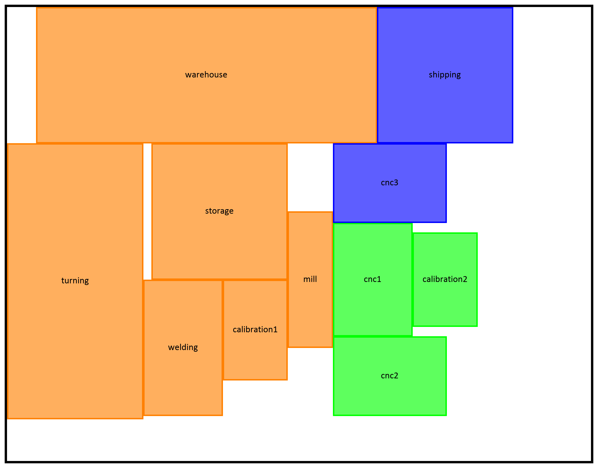

# Facility Layout Optimization

In this project, we investigated the question of how to arrange given departments within a facility. The desired layout has a high efficiency for some production processes. The present problem focuses on the aspect of minimizing transportation costs between the departments. This can be mathematically modeled as a mixed integer optimization problem. As solving it at once using the standard solver for MIPs Gurobi has a very long running time, we implemented an algorithm that solves the optimization problem in two stages. In the first step, relative positions are determined for the departments. This is done by solving a nonlinear minimization problem. With these relative positions the MIP can be simplified enough to be solvable with Gurobi within a short time. We based this project on the book [Facility Layout](https://link.springer.com/book/10.1007/978-3-030-70990-7) by Miguel F. Anjos and Manuel V.C. Vieira. For more information on the mathematical background, feel free to write us a message.

This program takes Excel files as an input where information about the facility, departments, and the dependencies between the departments are specified. Sample files are provided in the samples folder in [Excel Files](excel_files) directory.

Likewise, this program also outputs Excel File with the determined x- and y-coordinates of the departments. These can be directly imported into the program [visTABLE®](https://www.vistable.com/). Two visualizations are also generated (of first and second optimization step). It can be used as an intermediate step to inspect the output of this program without having to import it into visTABLE®. Here is an example visualization:

## Information about this project

This project was created in 2022 by [Sarah Gräßle](mailto:sarah.graessle@tum.de) ([Github](https://github.com/sgraes)), [Julia Schmalzbauer](mailto:julia.schmalzbauer@tum.de) ([Github](https://github.com/Julia-Schmalzbauer)), [Dario Schmid](mailto:da.schmid@tum.de) ([Github](https://github.com/darioschmid)), and [Andreas Seger](mailto:andreas.seger@tum.de) as part of a case study in discrete optimization at Technical University Munich, Germany. This project aims to solve the mathematical facility layout problem using a two-stage approach with nonlinear and linear optimization. For this purpose, we use scipy.optimize.minimize and our own implementation of gradient descent for the nonlinear part, and Gurobi for the integer program. This project was completed with the help of our supervisor at Technical University Munich, Dr. Michael Ritter, and Constantin Radzio at Voith Turbo GmbH, Garching bei München.

## Setup

### Download Code

Choose a folder where you want to download the code to. Now download the code, which you can do in two different ways:
  - Download [FacilityLayout-main.zip](https://github.com/darioschmid/FacilityLayout/archive/refs/heads/main.zip) and extract it to your chosen folder (recommended for non-programmers)
  - Run `git clone git@github.com:darioschmid/FacilityLayout.git` in your chosen folder.

Now you should have a new folder called `FacilityLayout` or `FacilityLayout-main` in your previously chosen directory, containing files like `README.md` or `requirements.txt`.

### Install Python and Packages

Firstly, make sure you have Python 3 installed. If not, go to [python.org](https://www.python.org/downloads/) and download the latest version. Generally any version above 3.0.0 should work.
Make sure to check the box "Add Python to PATH" and reboot after the installation is finished. Verify your Python installation by running `python --version` in your shell of choice (e.g. "Command Line" for Windows, "Terminal" for Mac and Linux).
Then install all packages listed in `requirements.txt` which can be achieved by running `pip install -r requirements.txt`, again in your shell of choice.

## Configuration

### Excel Files

Put your three input Excel files into `excel_files/import`, namely:
  - `Information.xlsx`
  - `Transportflow.xlsx`
  - `Transportmean.xlsx`

Or modify the already existing ones. Sample files can also be found at [excel_files/import/samples](excel_files/import/samples).

### Configuration File

`settings.ini` provides a way to customize the behavior of this program. You can modify:
  - Path for Excel input and output files
  - Path for Visualizations
  - Various settings for optimization process

## Run Program

Run `main.py` from your `FacilityLayout/src` or `FacilityLayout-main/src` folder, either by double-clicking on it, or running `python src/main.py` in your shell.

Please note that when double-clicking, the command line closes when the program finishes. If you want to see the output, open `FacilityLayout.log`.

## Troubleshooting

In the following you will find troubleshooting steps if one of the above steps fails.

### Download Code

`fatal: Could not read from remote repository. Please make sure you have the correct access rights and the repository exists`:
Please make sure your command does not contain any typos, and the link is up-to-date. 

`Command 'git' not found` or similar:
Please install git on your computer, or download the code [here](https://github.com/darioschmid/FacilityLayout/archive/refs/heads/main.zip).

### Install required Packages

`No such file or directory: 'requirements.txt'`:
Please make sure you are in the `FacilityLayout` or `FacilityLayout-main` folder in your shell. On Windows you can do that by navigating to that folder in the File Explorer and then type `cmd` in the top address bar and hitting enter. Then a command prompt window should appear.

### Run Code

`python: can't open file 'C:\...\src\main.py': [Errno 2] No such file or directory`:
Please make sure you are in the `FacilityLayout` or `FacilityLayout-main` folder in your shell. On Windows you can do that by navigating to that folder in the File Explorer, typing `cmd` in the top address bar, and hitting enter.

`Command 'python' not found`:
Can be the consequence of the following errors:
  - When installing Python, you did not check the box "Add Python to PATH". Run the installer again, click on "modify", and tick "Add Python to environment variables", and restart your machine.
  - You did not restart your machine after installing Python.
  - Windows is blocking the `python` command for the Microsoft Store version of Python. According to [this thread](https://stackoverflow.com/a/68215805) go to Settings → Apps & featues → Manage App Execution Aliases → Disable Python
  - Despite checking the box in the installer, the Python executable was not added to the environment variables. Copy the path of the installation folder (Usually `C:\Program Files\Python310` for Python 3.10), press Win+Pause → "Advanced  System Properties" → Environment variables → click on "Path" in list → "Edit" → "New" → Paste Python installation path from previously. Reboot your machine.
  - The Python installation was not successful. Try uninstalling and reinstalling.
